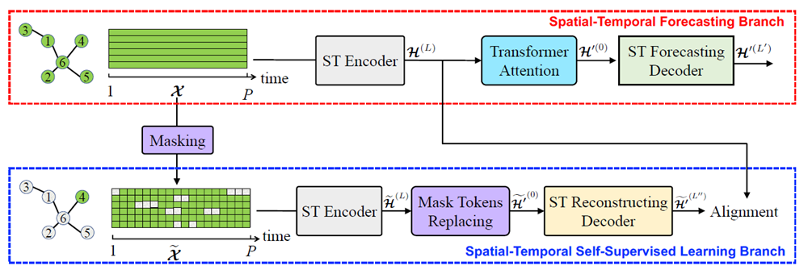
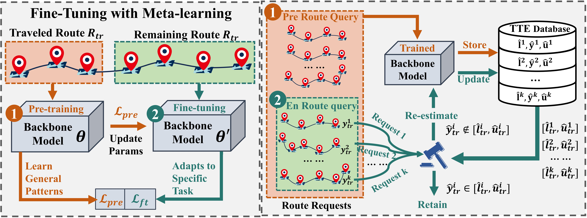








Hi, this is Zekai Shen(申泽楷)'s Home Page I received the B.S. degree from Beijing Jiaotong University, in 2022. I am currently pursuing my master degree in [School of Computer Science and technology](https://cs.bjtu.edu.cn/), Beijing Jiaotong University. And I am in [institute of network science and intelligent systems (INSIS)](http://insis.bjtu.edu.cn/index.html), supervised by [Shengnan Guo](https://faculty.bjtu.edu.cn/9685/) and [Huaiyu Wan](https://faculty.bjtu.edu.cn/8793/). 

My research interest includes **Spatial-Temporal Data Mining** and **Uncertainty Quantification**. 

I“m willing to share interesting papers about **spatial-temporal data** and **time series**. If you are interested, You can follow my  [Zhihu](https://www.zhihu.com/people/no1wds) and Official account named "[时空探索之旅](https://mp.weixin.qq.com/s/Y0rszFAeNplIbK1X-po9Qw)" ，Here is the QR Code of official accout：

# 🎉 News

* Paper "Towards An Efficient and Effective En Route Travel Time Estimation Framework" is accepted by **DASFAA 2025**! Thanks to my advisors and friends.

# 📝 Publications 

2023 ICDE

[Self-Supervised Spatial-Temporal Bottleneck Attentive Network for Efficient Long-term Traffic Forecasting](https://ieeexplore.ieee.org/abstract/document/10184658)\\
Shengnan Guo; Youfang Lin; Letian Gong; Chenyu Wang; Zeyu Zhou; **Zekai Shen**; Yiheng Huang; Huaiyu Wan
    

2025 DASFAA

[Towards An Efficient and Effective En Route Travel Time Estimation Framework](./)\\
**Zekai Shen**, Haitao Yuan, Xiaowei Mao, Congkang Lv, Shengnan Guo, Youfang Lin, Huaiyu Wan. 
    

# 🎖 Honors and Awards

1. First Prize Scholarship of Beijing Jiaotong University, 2022.(Top 5%)
2. First Prize Scholarship of Beijing Jiaotong University, 2023.(Top 5%)‘

# 📖 Educations
-  *2022.06 - 2025.06 (expected)*,  Master,  Beijing Jiaotong University, 
-  *2018.09 - 2022.06*, Undergraduate,  Beijing Jiaotong University. 

#  Activities

* Teaching Assistant(TA), Deep Learning, BJTU, Fall 2023 (**Excellent TA**)

* Teaching Assistant(TA), Deep Learning, BJTU, Fall 2022 (**Excellent TA**)

* Research Guidance, College Students' Innovation Project, BJTU.
  
  * Team Member: Yicong Zhu, Congkang Lv, Xuanting Ning. National-level (Top 10%), 2022-2023.
  
* AI Timer:  **Excellent volunteer**

  Here are some debate videos I host.

  * [Mamba：颠覆 Transformer 的全新架构？](https://www.bilibili.com/video/BV1om411q7kk/)
  * [MiniGPT-4、表格推理、代码生成、生成式推理-来自斯坦福、北大、阿卜杜拉、达摩院的四位论文一作思辨大模型](https://www.bilibili.com/video/BV1n24y1F7kv/?share_source=copy_web&vd_source=212c550e809e1331dff1d474634abadd) 
  * [来自国防科大、西湖、浙大、UCF的四位青年科学家共话大模型等AI前沿：AIGC、科学仿真、量化压缩感知](https://www.bilibili.com/video/BV1Zh411T7mX/?share_source=copy_web&vd_source=212c550e809e1331dff1d474634abadd)

# 💬 Invited Talks

# 💻 Internships
